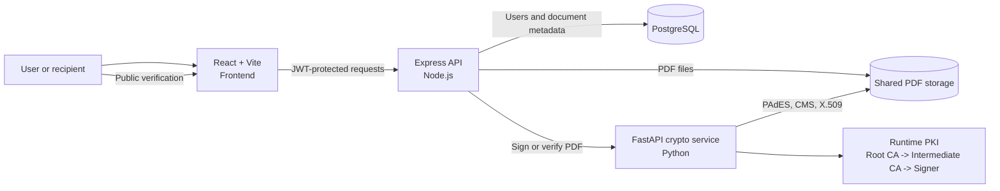

<div align="center">
  <h1>VeriPAdES</h1>
  <p><strong>Secure PDF signing and independent verification, built as a PAdES proof of concept.</strong></p>
</div>

<p align="center">
  
  
  
  
  
</p>

<p align="center">
  <a href="#quick-start">Quick Start</a> |
  <a href="#architecture">Architecture</a> |
  <a href="#api-overview">API</a> |
  <a href="#security-notes">Security</a> |
  <a href="#documentation">Documentation</a>
</p>

---

## Overview

**VeriPAdES** is a full-stack electronic-signature proof of concept for PDF documents. It combines authenticated document management, cryptographic PAdES signing, an X.509 certificate chain, and public integrity verification in one Docker-based workspace.

The platform separates business orchestration from cryptographic operations: the Node.js API manages users, documents, access control, and persistence, while the Python service owns the PKI, signing, and verification pipeline.

| Area | What VeriPAdES provides |
| --- | --- |
| Signing | PDF signing with a CMS signature, SHA-256 hashing, `ByteRange`, and embedded X.509 material |
| Trust model | Runtime Root CA, Intermediate CA, and signer certificate chain for local demonstration |
| Verification | Public verification by document ID or by uploading a signed PDF |
| Access control | JWT-protected user workspace for upload, listing, and signing actions |
| Platform | React frontend, Express API, FastAPI cryptographic service, and PostgreSQL database |

> This repository is an educational proof of concept. It demonstrates the mechanics of a PAdES signing workflow; it is not a qualified signature service and must not be used as-is for production or legal signing.

## Workflow


| Step | User action | System result |
| --- | --- | --- |
| 01 | Authenticate | The frontend receives a JWT for protected API operations. |
| 02 | Upload a PDF | The API validates and stores the document, then records its metadata and SHA-256 fingerprint. |
| 03 | Sign | The API delegates to the FastAPI service, which prepares the PKI and embeds a PAdES-compatible signature. |
| 04 | Verify | Any recipient can validate a signed PDF or a shared document ID without accessing the owner account. |

## Highlights

| Capability | Implementation |
| --- | --- |
| PDF integrity | SHA-256 and signed `ByteRange` validation detect modifications to the signed content. |
| PAdES-oriented signature | `pyHanko` produces the PDF signature container and CMS signature data. |
| Local PKI | A Root CA, Intermediate CA, and signer certificate are generated at runtime for the POC. |
| Certificate inspection | Verification exposes certificate subject, issuer, serial number, signature date, and chain data. |
| Document privacy | Owner operations require a valid JWT; public verification returns a deliberately filtered report. |
| Abuse protection | Public verification endpoints are rate-limited to 20 requests per minute per IP. |
| Operational readiness | Docker Compose starts the database, API, crypto service, frontend, health checks, and persistent volumes. |

## Architecture



| Service | Technology | Responsibility | Default port |
| --- | --- | --- | --- |
| `frontend` | React 19, Vite | Authentication, dashboard, signing and verification workspace | `5173` |
| `api` | Node.js 20, Express 5 | Authentication, authorization, document lifecycle, PostgreSQL access, crypto-service orchestration | `3000` |
| `crypto` | Python 3.11, FastAPI, pyHanko | PKI generation, PDF signing, cryptographic verification | `8000` |
| `db` | PostgreSQL 15 | Users and document metadata | `5433` on the host |

## Technology Stack

| Layer | Main technologies |
| --- | --- |
| Frontend | React, React Router, Axios, Lucide, Vite |
| API | Express, `jsonwebtoken`, `bcryptjs`, Multer, `pg`, `node-pg-migrate` |
| Cryptography | FastAPI, `cryptography`, pyHanko, `pyhanko-certvalidator`, ASN.1 tools |
| Data and runtime | PostgreSQL, Docker, Docker Compose |
| Tests | Jest, Supertest, Python executable verification scripts |

## Quick Start

### Prerequisites

| Tool | Required version |
| --- | --- |
| Docker Engine or Docker Desktop | Docker Compose v2 support |
| Git | Any recent version |

All application dependencies are installed inside the containers. Native development additionally expects Node.js `20+` for the JavaScript services and Python `3.11+` for the crypto service.

### 1. Create local configuration

The repository ships with an environment template. Create your local file and replace all sample secrets before running anything beyond a local demonstration.

```powershell
Copy-Item .env.example .env
```

Key variables are summarized below. The `.env` file is ignored by Git.

| Variable | Purpose |
| --- | --- |
| `DB_USER`, `DB_PASSWORD`, `DB_NAME` | PostgreSQL initialization values |
| `DATABASE_URL` | API connection string for PostgreSQL |
| `JWT_SECRET` | Secret used to sign and verify authentication tokens |
| `PKI_PASSPHRASE` | Passphrase protecting generated local private keys |
| `CRYPTO_SERVICE_URL` | Internal URL of the FastAPI service |
| `VITE_API_URL` | Public API base URL consumed by the frontend |

### 2. Start the platform

```powershell
docker compose up --build
```

The API container applies database migrations before starting. When all services are running, open [http://localhost:5173](http://localhost:5173).

### 3. Seed the local demonstration account

In a second terminal, run:

```powershell
docker compose exec api npm run seed:test-user
```

The seed script creates or updates the local POC account. Its credentials are intentionally limited to development and must never be reused in a shared or production environment.

### Useful Docker commands

| Task | Command |
| --- | --- |
| Start in the background | `docker compose up --build -d` |
| Follow service logs | `docker compose logs -f` |
| Stop services | `docker compose down` |
| Stop and remove local volumes | `docker compose down -v` |
| Re-run API migrations | `docker compose exec api npm run migrate` |

## API Overview

The Node.js API is exposed at `http://localhost:3000/api`.

| Method | Endpoint | Access | Description |
| --- | --- | --- | --- |
| `POST` | `/auth/register` | Public | Create a user account. |
| `POST` | `/auth/login` | Public | Authenticate and receive a JWT. |
| `POST` | `/documents` | JWT | Upload a PDF document. |
| `GET` | `/documents` | JWT | List documents belonging to the authenticated user. |
| `GET` | `/documents/:id` | JWT | Retrieve one owned document. |
| `POST` | `/documents/:id/sign` | JWT | Request cryptographic signing for a document. |
| `POST` | `/documents/:id/verify` | Public, rate-limited | Verify a signed document by its shared ID. |
| `POST` | `/documents/verify` | Public, rate-limited | Upload and independently verify a signed PDF. |

Protected endpoints require:

```http
Authorization: Bearer <JWT_TOKEN>
```

The public verification endpoints intentionally do not expose the document owner or account data.

## Testing

### API test suite

```powershell
docker compose exec api npm test
```

| Command | Coverage |
| --- | --- |
| `docker compose exec api npm run test:unit` | Authentication and JWT utility unit tests |
| `docker compose exec api npm run test:integration` | Registration, login, protected routes, and signing/verification flows |
| `docker compose exec api npm run test:coverage` | Jest coverage report |
| `docker compose exec -T api npm test` | Complete Jest suite from the API container |

### Cryptographic verification scripts

```powershell
docker compose exec crypto python test_ca.py
docker compose exec crypto python test_sign_pdf.py
docker compose exec crypto python test_verify_pdf.py
```

These scripts generate test certificates and PDFs under `crypto_service/artifacts/`, sign a PDF, then confirm that a tampered signed PDF is rejected. Generated keys, certificates, PDFs, and artifacts are intentionally excluded from Git.

## Security Notes

| Topic | Current design | Production expectation |
| --- | --- | --- |
| Private keys | Generated locally and encrypted with `PKI_PASSPHRASE` | Use an HSM, remote signing service, or managed key vault |
| Certificate trust | Local Root and Intermediate CA created for the POC | Integrate a trusted CA, revocation services, and a lifecycle policy |
| Secrets | Environment variables kept in `.env` | Use a managed secret store and rotate secrets |
| Authentication | JWT-based authentication | Use strong secret rotation, secure cookie or token policy, and monitoring |
| Verification | Signature integrity and certificate information are inspected | Add revocation checks, trusted timestamping, audit retention, and legal compliance controls |
| Public endpoints | Rate limiting and filtered response model | Add observability, WAF controls, abuse detection, and formal threat modeling |

Never commit `.env` files, private keys, certificates, generated PDFs, databases, or runtime artifacts. The root `.gitignore` is configured to protect these local files.

## Project Structure

```text
veripades/
|- frontend/              React user interface
|- backend/               Express API, database access, tests, and migrations
|- crypto_service/        FastAPI signing and verification service
|- docs/                  Technical documentation and README assets
|- docker-compose.yml     Local multi-service orchestration
|- .env.example           Environment-variable template
`- README.md              Repository guide
```

## Documentation

| Document | Focus |
| --- | --- |
| [Complete Project Guide](docs/GUIDE-COMPLET-PROJET.md) | Cryptographic foundations, implementation choices, and end-to-end narrative |
| [API Reference](docs/api.md) | Authentication and document endpoints |
| [Signature Design](docs/signature.md) | Signing implementation details |
| [Verification Design](docs/verification.md) | PAdES verification workflow |
| [Security Notes](docs/securite.md) | Security architecture and controls |
| [Deployment Guide](docs/deploiement.md) | Docker deployment considerations |

## Scope and Roadmap

| Included in this POC | Recommended next step |
| --- | --- |
| Local PKI and encrypted local keys | Hardware-backed or remote qualified signing |
| Local PDF storage volume | Object storage with access policy and retention controls |
| JWT authentication | Refresh strategy, token revocation, MFA, and audit trails |
| Basic public verification rate limiting | Centralized monitoring and production abuse protection |
| Certificate-chain inspection | OCSP/CRL validation and trusted timestamp authority integration |

## Author

| | |
| --- | --- |
| **Author** | Bugshadow |
| **Project** | End-of-study internship project, 2026 |

---

<p align="center">VeriPAdES is a technical proof of concept for secure PDF signing and verification.</p>


